```mermaid
graph LR
    A[ray-lattice<br/><sub>structural index</sub>] --> B[ray-prism<br/><sub>directory digests</sub>]
    B --> C[ray-blueprint<br/><sub>knowledge base</sub>]
    C --> D[ray-perimeter<br/><sub>threat model</sub>]
    D --> E[ray-compass<br/><sub>review plan</sub>]
    E --> F[ray-prospector<br/><sub>code audit</sub>]
    E --> N[domain audit suite<br/><sub>9 specialized sweeps</sub>]
    F --> G[ray-condenser<br/><sub>dedupe</sub>]
    N --> G
    G --> H[ray-arbiter<br/><sub>adversarial review</sub>]
    H --> I[ray-magistrate<br/><sub>viability judge</sub>]
    I --> J[ray-detonator<br/><sub>PoC + reproduce</sub>]
    J --> K[ray-gauge<br/><sub>risk scoring</sub>]
    K --> L[ray-chronicle<br/><sub>report</sub>]
    F -.-> M[ray-retrospective<br/><sub>learnings</sub>]
    
    classDef default fill:#1a1a24,stroke:#4a4a6a,stroke-width:2px,color:#fff;
    classDef meta fill:#2a1a3a,stroke:#6a4a8a,stroke-width:2px,color:#fff;
    classDef domain fill:#1a2a24,stroke:#4a8a6a,stroke-width:2px,color:#fff;
    class M meta;
    class A meta;
    class N domain;
```

<h1>Ray Framework</h1>

<strong>An agentic, evidence-first security review pipeline built as a set of composable Claude Skills.</strong>

 

  

<em>Ray decomposes a full security audit&mdash;from mapping a codebase to shipping a stakeholder-facing report&mdash;into independent, single-responsibility stages.</em>

<h2>Why Ray Exists</h2>

Most LLM-driven vulnerability scanners rely on a single prompt asking <em>"is this code vulnerable?"</em>. This approach yields unpredictable false-positive and false-negative rates, essentially acting on the model's disposition.

<strong>Ray takes a distinct approach: No single model call serves as the final verdict.</strong>

<ul>
  <li><strong>Findings start as guilty, not innocent.</strong> The validation stage assumes every reported anomaly is a false positive. It must be explicitly disproven against the source code to survive.</li>
  <li><strong>A vulnerability is not confirmed until it is reproduced.</strong> Static suspicion triggers a sandboxed proof-of-concept. Authentic execution evidence (e.g., a sanitizer trace, an unauthorized HTTP 200 response, a crash signal) is strictly required.</li>
  <li><strong>Severity is capped, not merely scored.</strong> A rules-based sanity layer mitigates inflated severity by identifying dead code, test-only paths, implausible attacker positions, or missing defense-in-depth measures. A HIGH severity finding represents a validated risk.</li>
  <li><strong>The codebase is frozen mid-audit.</strong> Every execution pass runs against an immutable, content-hashed snapshot. A finding's line numbers, unresolved status, and regression history remain accurate as the repository evolves.</li>
  <li><strong>Nothing is silently discarded.</strong> Ambiguous cases are routed to <code>NEEDS_RESEARCH</code>, ensuring manual review. Regressions are explicitly flagged and tracked.</li>
</ul>

<h2>Execution Model &amp; Requirements</h2>

Be clear-eyed about what this plugin is, because it changes what you should expect from it. Ray is <strong>not</strong> a self-contained scanner that runs on its own. It is a body of <strong>skills (know-how), agent role definitions, and a few real bundled tools</strong> that a tool-capable host — Claude Code, Codex, Gemini CLI, or any Agent-Skills runtime — executes. It shines <em>because</em> of that host, not in spite of it: the host supplies the execution surface, and Ray supplies the discipline that drives it.

Concretely, Ray is honest about what it <strong>ships</strong> versus what it <strong>drives</strong>:

<ul>
  <li><strong>Ships (real, in this repo):</strong> the skill and agent definitions; the curated-memory helper (<code>scripts/ray_memory.py</code>); the dependency-free document-metadata extractor (<code>scripts/ray_metadata.py</code>); the SCA/SBOM and IaC helpers (<code>scripts/ray_sbom.py</code>, <code>scripts/ray_iac.py</code>); the gated red/blue arsenal adapter (<code>scripts/ray_arsenal.py</code>); the redacting secret-leak scanner (<code>scripts/ray_secrets.py</code>); and an <strong>MCP server</strong> (<code>scripts/ray_mcp_server.py</code>) that exposes those helpers as first-class tools.</li>
  <li><strong>Drives (borrowed from the host + environment):</strong> the host's built-in tools (<code>Bash</code>, <code>Read</code>, <code>Edit</code>, <code>WebFetch</code>, …) and whatever security binaries happen to be installed (<code>nmap</code>, <code>gitleaks</code>, <code>tfsec</code>, <code>osv-scanner</code>, …). When a driven binary is absent, the skill falls back to a bundled dependency-free path and says so — it never pretends a tool ran.</li>
</ul>

The <code>tools:</code> field in each agent definition is an <strong>allowlist that selects</strong> from the host's built-in tools — it restricts an agent to what it needs; it does not invent new capability. New capability comes from the bundled scripts and the MCP tools.

<strong>Minimum requirement: a host with a real execution surface — at least <code>Bash</code> and <code>python3</code>.</strong> Given only skills and no way to execute, a weaker model could <em>narrate</em> tool use it never performed. Ray is built to resist exactly that: findings are <strong>evidence-first</strong> (a siege break-in demands a live canary; recon demands a metadata field actually extracted), the bundled helpers are <strong>dependency-free</strong> so they work in a bare environment, and the <strong>MCP tools cannot be faked</strong> — a tool call either executes and returns a result or returns an error. Install Ray somewhere it can actually run; without an execution surface, skills degrade to roleplay.

<h3>Real tools over MCP (<code>ray-tools</code>)</h3>

The bundled <code>.claude-plugin</code> declares an <code>mcpServers</code> entry that starts <code>scripts/ray_mcp_server.py</code> — a stdlib-only MCP server (no pip install, no external dependency) exposing Ray's helpers as callable tools: <code>ray_metadata_extract</code>, <code>ray_memory_recall</code>/<code>_add</code>/<code>_list</code>, (with the matching skills) <code>ray_sbom_generate</code> and <code>ray_iac_scan</code>, the <code>ray-siege</code> arsenal adapters <code>ray_arsenal_list</code>/<code>ray_arsenal_run</code>, and the <code>ray-cloak</code> secret-leak scanner <code>ray_secret_scan</code>. On Claude Code they register automatically with the plugin; any MCP-capable client can launch the same server. This is the difference between "the skill tells the model to run a script" and "the model calls a tool that provably ran."

The two <strong>arsenal</strong> tools are the honesty layer for the red/blue loop: <code>ray_arsenal_list</code> probes which real pentest tools (<code>nmap</code>, <code>sqlmap</code>, <code>jwt_tool</code>, <code>garak</code>, <code>semgrep</code>, <code>gitleaks</code>, <code>tfsec</code>, …) are actually installed, so an agent cannot claim output from a tool that is absent; <code>ray_arsenal_run</code> drives a tool only through a fail-closed gate that mirrors the siege protocol (loopback-only target, no smuggled remote host, no escalation/exfil switches) and returns a documented fallback when the binary is missing. Ray drives real tools — it never embeds them.

<h2>Pipeline Architecture</h2>

Each stage degrades gracefully if surrounding modules are unavailable, ensuring no single point of failure disrupts the campaign.

<h2>The Skills Suite</h2>

Ray's architecture relies on distinct, isolated skills. Each directory is self-contained with a dedicated <code>SKILL.md</code> documentation file.

<table>
  <thead>
    <tr>
      <th>Skill</th>
      <th>Stage</th>
      <th>Description</th>
    </tr>
  </thead>
  <tbody>
    <tr>
      <td><strong><code>ray-prism</code></strong></td>
      <td>Pre-processing</td>
      <td>Generates bottom-up, security-focused digests of every directory.</td>
    </tr>
    <tr>
      <td><strong><code>ray-blueprint</code></strong></td>
      <td>Knowledge base</td>
      <td>Synthesizes architecture, entities, and data flows into a linked knowledge base.</td>
    </tr>
    <tr>
      <td><strong><code>ray-perimeter</code></strong></td>
      <td>Knowledge base</td>
      <td>Builds the threat model, defining trust boundaries, attacker profiles, and assets.</td>
    </tr>
    <tr>
      <td><strong><code>ray-compass</code></strong></td>
      <td>Planning</td>
      <td>Translates the threat model and history into a targeted investigation roadmap.</td>
    </tr>
    <tr>
      <td><strong><code>ray-prospector</code></strong></td>
      <td>Discovery</td>
      <td>Performs wave-based swarm auditing of source files against the generated plan.</td>
    </tr>
    <tr>
      <td><strong><code>ray-condenser</code></strong></td>
      <td>Consolidation</td>
      <td>Merges duplicate findings across parallel sub-agents and execution passes.</td>
    </tr>
    <tr>
      <td><strong><code>ray-arbiter</code></strong></td>
      <td>Validation</td>
      <td>Assumes every finding is a false positive; actively attempts to disprove findings.</td>
    </tr>
    <tr>
      <td><strong><code>ray-magistrate</code></strong></td>
      <td>Validation</td>
      <td>Judges production viability, filtering out dead code, debug builds, and test-only paths.</td>
    </tr>
    <tr>
      <td><strong><code>ray-detonator</code></strong></td>
      <td>Verification</td>
      <td>Develops and executes sandboxed PoCs, demanding concrete execution evidence.</td>
    </tr>
    <tr>
      <td><strong><code>ray-gauge</code></strong></td>
      <td>Scoring</td>
      <td>Computes the final risk utilizing 27 sanity caps to prevent over-scoring and under-scoring.</td>
    </tr>
    <tr>
      <td><strong><code>ray-chronicle</code></strong></td>
      <td>Reporting</td>
      <td>Produces the finalized, stakeholder-facing Markdown review packet.</td>
    </tr>
    <tr>
      <td><strong><code>ray-retrospective</code></strong></td>
      <td>Meta</td>
      <td>Extracts durable lessons from agent trajectories for future passes.</td>
    </tr>
    <tr>
      <td><strong><code>ray-lattice</code></strong></td>
      <td>Meta (optional)</td>
      <td>Builds an AST-level structural index tailored for grep-scale codebases.</td>
    </tr>
    <tr>
      <td><strong><code>ray-foundry</code></strong></td>
      <td>Meta</td>
      <td>Acts as an interactive consultant for engineering custom orchestrators around Ray.</td>
    </tr>
  </tbody>
</table>

<h2>The Domain Audit Suite</h2>

The core pipeline is domain-agnostic: it maps, plans, audits, validates, reproduces, and scores whatever the codebase happens to be. The domain audit suite adds specialized discovery stages, each carrying a single security domain's obligation set so the rest of the pipeline does not have to.

<strong>They are drop-in siblings of <code>ray-prospector</code>.</strong> Each one writes standard finding JSON to <code>workspace/findings/&lt;uuid&gt;.json</code> — same schema, same <code>signature</code>/<code>lineage_id</code>/<code>discovery_commit</code> rules, same snapshot pinning — so <code>ray-condenser</code> through <code>ray-chronicle</code> consume their output unchanged. They can run in place of, or alongside, the generic audit stage.

<strong>Each skill is structured for progressive disclosure.</strong> The <code>SKILL.md</code> carries the workflow and the pointers; the detail lives in <code>references/</code> and is read only when a step calls for it. Every skill ships a <code>findings_contract.md</code> (schema, the four computed fields, CWE set, evidence discipline, severity defaults, ledger format) plus one or more domain dockets. That keeps the always-loaded body around 200&ndash;280 lines while the obligation sets behind it stay as long as they need to be.

Each also writes a <strong>control ledger</strong> to <code>workspace/ledgers/&lt;skill&gt;.json</code>, recording every control that was checked and its state (<code>PRESENT</code>, <code>PARTIAL</code>, <code>ABSENT</code>, <code>NOT_APPLICABLE</code>, <code>UNKNOWN</code>). This is what makes the <em>absence</em> of a finding meaningful: a control marked <code>NOT_APPLICABLE</code> with a stated reason is a documented security decision; a silent omission is not.

<table>
  <thead>
    <tr>
      <th>Skill</th>
      <th>Domain</th>
      <th>Description</th>
      <th>References</th>
    </tr>
  </thead>
  <tbody>
    <tr>
      <td><strong><code>ray-custodian</code></strong></td>
      <td>Data protection</td>
      <td>Personal-data inventory, TLS and response headers, cookie flags, consent ordering, retention, data-subject rights, and third-party PII egress (LGPD/GDPR).</td>
      <td><code>privacy_docket.md</code> <code>web_surface_baseline.md</code> <code>findings_contract.md</code></td>
    </tr>
    <tr>
      <td><strong><code>ray-turnstile</code></strong></td>
      <td>SaaS identity &amp; tenancy</td>
      <td>Credential storage, sessions and JWTs, MFA and credential stuffing, recovery flows, IDOR/BOLA/BFLA authorization, tenant isolation, secrets, and races on critical operations.</td>
      <td><code>identity_docket.md</code> <code>tenancy_isolation.md</code> <code>findings_contract.md</code></td>
    </tr>
    <tr>
      <td><strong><code>ray-crucible</code></strong></td>
      <td>Untrusted input</td>
      <td>Sink-driven sweep of the OWASP canon: injection, XSS, CSRF, SSRF, deserialization, traversal, upload, redirect, prototype pollution, timing, and dependencies.</td>
      <td><code>injection_docket.md</code> <code>owasp_mapping.md</code> <code>findings_contract.md</code></td>
    </tr>
    <tr>
      <td><strong><code>ray-seam</code></strong></td>
      <td>Client/server trust seam</td>
      <td>Error leakage and fail-open paths, backend validation, mass assignment, CORS, client-side credential storage, bundle secrets, log hygiene, limits, caching, and client-supplied values.</td>
      <td><code>seam_docket.md</code> <code>findings_contract.md</code></td>
    </tr>
    <tr>
      <td><strong><code>ray-sentry</code></strong></td>
      <td>Service protection</td>
      <td>Rate limiting by cost class, exposed internal endpoints, service-to-service auth, API key lifecycle, GraphQL limits, webhook signatures, audit logging, and alerting.</td>
      <td><code>service_docket.md</code> <code>findings_contract.md</code></td>
    </tr>
    <tr>
      <td><strong><code>ray-vault</code></strong></td>
      <td>Datastore exfiltration</td>
      <td>Database privileges, network reachability, encryption in transit/at rest/at field level, credential sourcing, backups and restore testing, non-production copies, and data-layer auditing.</td>
      <td><code>datastore_hardening.md</code> <code>findings_contract.md</code></td>
    </tr>
    <tr>
      <td><strong><code>ray-citadel</code></strong></td>
      <td>Architecture at scale</td>
      <td>Network layering, statelessness, environment isolation, secret topology, pipeline and supply-chain integrity, container and Kubernetes hardening, observability, and incident readiness.</td>
      <td><code>architecture_baseline.md</code> <code>findings_contract.md</code></td>
    </tr>
    <tr>
      <td><strong><code>ray-marrow</code></strong></td>
      <td>Memory-safety &amp; systems</td>
      <td>Sink-driven sweep of native/unsafe code: out-of-bounds read/write, use-after-free/double-free, integer overflow &amp; narrowing, type confusion, format strings, uninitialized reads, stack/alloca, and low-level data races — with the allocator/SIMD-padding trap built in.</td>
      <td><code>memory_safety_docket.md</code> <code>findings_contract.md</code></td>
    </tr>
    <tr>
      <td><strong><code>ray-oracle</code></strong></td>
      <td>AI / LLM integration</td>
      <td>The target app's own LLM surface (OWASP LLM Top 10): prompt injection (direct/indirect/RAG), insecure model-output handling, excessive agency &amp; tool abuse, system-prompt/data disclosure, unbounded consumption, and RAG/artifact poisoning.</td>
      <td><code>llm_security_docket.md</code> <code>findings_contract.md</code></td>
    </tr>
    <tr>
      <td><strong><code>ray-manifest</code></strong></td>
      <td>Dependencies / SBOM</td>
      <td>Software-composition analysis: parses lockfiles across ecosystems, emits a CycloneDX SBOM, and flags known-vulnerable versions (OSV.dev or an installed scanner), risky licenses, typosquats/dependency-confusion, and floating/unmaintained deps — the risk you inherit rather than write.</td>
      <td><code>sca_docket.md</code> <code>findings_contract.md</code></td>
    </tr>
    <tr>
      <td><strong><code>ray-terrain</code></strong></td>
      <td>Infrastructure-as-Code</td>
      <td>IaC &amp; cloud-posture misconfig (Terraform/CFN/K8s/Docker/compose): open-to-the-world ingress, wildcard IAM, public storage, unencrypted resources, privileged containers, secrets in IaC — with a <code>file:line</code> anchor and, behind a read-only gate, live-posture corroboration.</td>
      <td><code>iac_docket.md</code> <code>findings_contract.md</code></td>
    </tr>
    <tr>
      <td><strong><code>ray-steward</code></strong></td>
      <td>Maintenance / resilience</td>
      <td>Forward-looking upkeep: dependency freshness &amp; EOL, patch cadence, backup <em>and verified restore</em>, migration safety, DR/runbook readiness, secret rotation, and observability/alert coverage — the slow-decay risks a point-in-time audit misses.</td>
      <td><code>maintenance_docket.md</code> <code>findings_contract.md</code></td>
    </tr>
  </tbody>
</table>

The suite began web-centric; the later siblings extend it to the classes an advanced reviewer reaches beyond the OWASP web canon — native memory-safety (<code>ray-marrow</code>), the application's AI integration (<code>ray-oracle</code>), inherited dependency risk (<code>ray-manifest</code>), infrastructure-as-code misconfiguration (<code>ray-terrain</code>), and over-time maintenance/resilience (<code>ray-steward</code>). All are the same drop-in siblings of <code>ray-prospector</code>, writing the same finding JSON.

<h3>Running a Domain Sweep</h3>

<pre><code>/ray-custodian    # privacy and web-surface exposure
/ray-turnstile    # identity, authorization, tenancy
/ray-crucible     # untrusted-input canon
/ray-seam         # client/server trust boundary
/ray-sentry       # abuse resistance and detection
/ray-vault        # datastore exfiltration barriers
/ray-citadel      # deployed architecture
/ray-marrow       # native memory-safety (C/C++/Rust-unsafe/FFI)
/ray-oracle       # the app's LLM/AI integration
/ray-manifest     # dependencies: SBOM + known-vulnerable versions
/ray-terrain      # infrastructure-as-code & cloud misconfig
/ray-steward      # maintenance & resilience over time</code></pre>

Run whichever domains the target actually has, then continue into <code>/ray-condenser</code> and the rest of the validation chain exactly as with a generic pass. Domains overlap deliberately at their edges (each <code>SKILL.md</code> ends with a <em>Boundary With Adjacent Skills</em> section); overlapping findings are merged by <code>ray-condenser</code>, never lost.

<h2>External Attack-Surface Recon (<code>ray-quarry</code>)</h2>

Before the pipeline reasons about a snapshot, an attacker learns what your surface leaks. <code>ray-quarry</code> measures that first: it maps the external footprint of assets you <strong>own or are explicitly authorized to assess</strong> &mdash; the hostnames and certificates that name your estate, the services and software versions at its edge, and the quiet leaks (a username and an internal file path baked into a published PDF's metadata, an API key committed to your own repo) that hand an attacker a foothold for free.

It is <strong>passive-first</strong>: DNS, certificate-transparency logs, WHOIS/RDAP, published-document metadata, and your own repos are read without sending anything intrusive to the target. Bounded <strong>active</strong> enumeration (port/service and version fingerprinting, non-exploit template checks) runs only against hosts the scope file marks <code>active_ok</code>. The FOCA-style document-metadata method ships as a <strong>dependency-free extractor</strong> (<code>scripts/ray_metadata.py</code>, stdlib only) that reads PDF <code>/Info</code>+XMP, Office <code>docProps</code>, and image EXIF, then harvests leaked paths, usernames, and internal hosts &mdash; so the highest-signal recon works even in a bare environment.

<strong>Authorization is fail-closed.</strong> Recon runs only against a signed <strong>scope attestation</strong> the user owns; every asset touched must resolve to an attested entry, and there is no override for out-of-scope targets. The restraint rules are invariants: <strong>no mass-targeting, no DoS, no exploitation, no evasion</strong> &mdash; <code>ray-quarry</code> observes the surface, it never attacks it. Findings feed <code>ray-perimeter</code> (a <em>measured</em> threat model), and an in-scope host you can stand up locally feeds <code>ray-siege</code>.

<pre><code>/ray-quarry --scope_file=scope.yaml                 # passive footprint of an attested surface
/ray-quarry --scope_file=scope.yaml --mode=active   # + bounded enumeration of active_ok hosts
/ray-quarry --docs=./published --repo_root=.        # mine document metadata and scan own repo for secrets</code></pre>

<h2>The Live Adversary Loop (<code>ray-siege</code>)</h2>

Every stage above reasons about a <strong>frozen snapshot</strong>. <code>ray-siege</code> is the one that leaves the snapshot behind: after you have built a security-sensitive project, it stands up a <strong>disposable local instance</strong> and runs a red-team / blue-team loop against the app while it is actually running &mdash; attacking for real, patching, and re-attacking until the app holds.

<table>
  <thead>
    <tr><th>Component</th><th>Role</th><th>Description</th></tr>
  </thead>
  <tbody>
    <tr>
      <td><strong><code>ray-siege</code></strong></td>
      <td>Orchestrator skill</td>
      <td>Stands up the disposable local target with a throwaway database and seeded canaries, then drives the loop round by round, keeping all state in a siege ledger on disk.</td>
    </tr>
    <tr>
      <td><strong><code>ray-reaver</code></strong></td>
      <td>Red-team subagent</td>
      <td>A senior offensive engineer that breaks in <em>for real</em> across the classes the seven dockets enumerate, and proves every break-in with a harmless canary &mdash; not a diagnosis, an actual compromise.</td>
    </tr>
    <tr>
      <td><strong><code>ray-bulwark</code></strong></td>
      <td>Blue-team subagent</td>
      <td>A senior developer that writes the minimal, idiomatic fix for each proven hole, commits it to a dedicated siege branch, and touches nothing else.</td>
    </tr>
  </tbody>
</table>

The loop reuses the machinery Ray already had rather than reinventing it: <code>ray-detonator</code>'s sandbox isolation and execution-evidence gate, its <code>--reattack</code> variant-hunting (&ge;3 boundary-mutated variants so a patch can't be overfit), and the <code>repro_status</code> / <code>reattack_status</code> / <code>patch_status</code> enums. The two roles run as <strong>isolated subagents</strong> &mdash; separate context windows are what keep each locked in character.

<strong>Safety is fail-closed and non-negotiable.</strong> The target must resolve to loopback on a disposable instance the skill itself stood up; a non-local target stops the siege. Destructive techniques are prohibited outright (no DoS, no data destruction, no persistence, no exfiltration to real hosts); every break-in is proven with an inert canary. This is authorized defensive tooling &mdash; it attacks only the user's own project, locally, to find and close holes.

<strong>Both agents drive a curated, gated arsenal.</strong> <code>ray-reaver</code> and <code>ray-bulwark</code> don't reimplement pentest tools &mdash; they drive the real binary when it is installed and fall back to a dependency-free technique when it is not, all through the <code>ray-tools</code> MCP adapter (<code>ray_arsenal_list</code>/<code>ray_arsenal_run</code>). The offensive set is curated to the siege's real target (a local web/API/LLM app): recon (<code>nmap</code>, <code>httpx</code>), web/injection (<code>ffuf</code>, <code>nuclei</code>, <code>sqlmap</code>), API/identity (<code>arjun</code>, <code>jwt_tool</code>), and LLM red-team (<code>garak</code>, <code>promptfoo</code>); the defensive set pairs each with a counterpart (<code>semgrep</code> for the root cause, <code>gitleaks</code> for secret hygiene, <code>tfsec</code> for infra). Every invocation inherits the same loopback-only gate; a scanner only <em>seeds</em> candidates, and a finding still requires a canary. The full catalogs are <code>ray-siege/references/reaver_arsenal.md</code> and <code>bulwark_arsenal.md</code>.

<pre><code>/ray-siege        # after building the project: attack the running local app and harden it in a loop
                  # (delegates to the ray-reaver and ray-bulwark subagents)</code></pre>

It stops on a <strong>clean round</strong> (a full attack pass gets in nowhere and every prior hole is re-verified closed) or a safety cap on rounds, then writes a siege report and leaves the patch branch for you to review and merge.

<h2>Detection &amp; Response Analyst (<code>ray-warden</code>)</h2>

Where <code>ray-siege</code>'s blue team fixes the <em>code</em>, <code>ray-warden</code> detects and responds to the <em>exploitation</em> of a running estate. It is the analyst <strong>brain</strong>, not a SOC platform: it plugs into whatever signals and tools the environment has and supplies the disciplined reasoning &mdash; the same triage every time, corroboration before belief, confidence before action, and a human on every irreversible decision.

<table>
  <thead>
    <tr><th>Component</th><th>Role</th><th>Description</th></tr>
  </thead>
  <tbody>
    <tr>
      <td><strong><code>ray-warden</code></strong></td>
      <td>Orchestrator skill</td>
      <td>Ingests alerts, opens one case per correlated incident, dispatches the analyst, then drives a <strong>tiered, audited</strong> response &mdash; keeping the circuit-breaker and audit state on disk.</td>
    </tr>
    <tr>
      <td><strong><code>ray-vigil</code></strong></td>
      <td>Analyst subagent</td>
      <td>A senior SOC analyst that runs the class playbook, correlates multi-source signals read-only, and returns a <strong>verdict + confidence + key signal + tier-appropriate recommendation</strong> &mdash; it never executes containment itself.</td>
    </tr>
  </tbody>
</table>

<strong>Autonomy is bounded by what is reversible and certain.</strong> Read-only enrichment (<strong>Tier&nbsp;1</strong>) is autonomous; reversible containment (<strong>Tier&nbsp;2</strong>, e.g. revoke one session, isolate one host) runs autonomously only within an operator <strong>allowlist</strong>, under a <strong>circuit breaker</strong>, and only at high confidence &mdash; every action records its rollback before it runs; anything irreversible or mass-scale (<strong>Tier&nbsp;3</strong>) is <strong>always</strong> handed to a human with a decision packet. Every action &mdash; proposed, taken, or rolled back &mdash; lands in an append-only audit log. Hostile material (phishing bodies, malware strings, attacker-controlled logs) is treated as <strong>data, never instructions</strong>; severity and confidence are scored on separate axes so a high-stakes, low-certainty case escalates fast but is never contained on a coin-flip.

<pre><code>/ray-warden --alerts=./alerts.json                                   # investigate &amp; propose (default)
/ray-warden --alerts=./alerts.json --allowlist=resp.yaml --mode=respond  # + autonomous reversible containment</code></pre>

An unattended 24/7 autonomous SOC is a different product with a different risk posture; <code>ray-warden</code> is honest about being the reasoning core a human or a harness drives, with the authority gate always closed around it.

<h2>General Code Review (<code>ray-loupe</code>)</h2>

Ray is security-first, but a change also needs a plain, thorough code review. <code>ray-loupe</code> is a high-precision general reviewer — the review counterpart to the security pipeline. It reviews a working-tree diff, a branch range, a commit, or a file scan across the full taxonomy: <strong>correctness, security (triage), performance, maintainability, tests, style, and documentation</strong>.

Its governing rule is <strong>precision over recall</strong> — a false alarm costs more reviewer trust than a missed minor issue — enforced by an isolated per-file reviewer (<code>ray-scrivener</code>), explicit per-language <em>"do not report"</em> lists, deconfliction with linters, and a <em>falsify-don't-verify</em> self-check that may only veto a finding it can disprove from the diff alone.

Four things it does that a general reviewer usually does not:

<ul>
  <li><strong>Cross-file &amp; architectural findings</strong> — a caller and callee changed inconsistently, a missed call-site — using the <code>ray-lattice</code> AST index, not just grep.</li>
  <li><strong>Delegates deep security</strong> to the domain suite (a <code>security</code> finding is triaged and routed to <code>/ray-crucible</code>, <code>/ray-turnstile</code>, …), rather than a shallow security pass.</li>
  <li><strong>Reviews test files</strong> too — a bad test is a real defect.</li>
  <li><strong>Long-term reviewer memory</strong> — <code>ray-scrivener</code> learns a project's house style and recurring defects across runs.</li>
</ul>

<pre><code>/ray-loupe --range main..feature   # review a branch
/ray-loupe --commit abc123         # review one commit
/ray-loupe                         # review the working-tree diff
/ray-loupe --scan --paths src/     # first-pass audit of existing files</code></pre>

It writes ranked findings (with a <code>category</code>), a human review report, and a coverage ledger that records every in-scope file's terminal state, so a partial review never claims to be complete.

<h2>Curated Agent Memory</h2>

The framework's subagents keep a <strong>curated, global memory</strong> that persists and compounds across every run and every project, so they get sharper over time: <code>ray-reaver</code> remembers attack techniques that worked and defenses that blocked it, <code>ray-bulwark</code> remembers the fixes that held and the over-narrow patches that got bypassed, <code>ray-scrivener</code> remembers a project's house style and recurring defects, and <code>ray-vigil</code> remembers the false-positive patterns to stop crying wolf on and the true-positive tells it under-weighted &mdash; human confirmations and overturns being the highest-value lesson it keeps.

It is a deliberately small, local, free layer (<code>scripts/ray_memory.py</code>, stdlib only) with a firm boundary: memory is born <strong>only</strong> from the agent's own work — never ingested from email, files, or history — follows a NOTICE&nbsp;&rarr;&nbsp;FILE&nbsp;&rarr;&nbsp;RECALL loop, and a hard character cap forces high signal over a data dump. Files live at <code>~/.claude/ray-memory/&lt;agent&gt;.md</code>. The full contract, and an optional future SQLite/FTS5 layer, are documented in <code>scripts/ray-memory.md</code>.

<h2>Design Principles</h2>

<ol>
  <li><strong>Deterministic contracts.</strong> Every skill explicitly declares its read operations, write operations, and idempotency guarantees.</li>
  <li><strong>Snapshot-pinned by default.</strong> Executions run against one frozen, content-hashed repository state, ensuring reproducibility and precise regression tracking.</li>
  <li><strong>Strictly advisory accelerators.</strong> Optional components (such as semantic retrieval or structural indexing) may reorder workloads but cannot authorize the skipping of files or call-sites.</li>
  <li><strong>Fail conservative.</strong> When a stage cannot confidently ascertain a result, it routes to <code>NEEDS_RESEARCH</code>, <code>not_attempted</code>, or <code>UNKNOWN</code>. It never issues a false positive clearance.</li>
  <li><strong>Token-efficient state management.</strong> State resides on disk via UUID-keyed JSON objects. Agents communicate via references rather than transmitting extensive text payloads.</li>
  <li><strong>Coverage is recorded, not implied.</strong> Domain stages write a control ledger listing every control checked and its state. A control that does not apply is marked so, with a reason; the absence of a finding is only meaningful when the check is on record.</li>
</ol>

<h2>Multi-AI Integration & Getting Started</h2>

Ray Framework is engineered to be platform-agnostic and works seamlessly across multiple AI agent environments. On Claude Code it installs as a first-class <strong>plugin</strong>; on every other assistant the skills are plain <code>SKILL.md</code> directories you copy into place.

<h3>Install as a Claude Code plugin (recommended)</h3>

The repository ships a <code>.claude-plugin/</code> with a plugin manifest and a marketplace catalog, so the entire framework installs in two commands — no files to copy:

<pre><code>/plugin marketplace add GameDev531/ray-framework
/plugin install ray@ray-framework</code></pre>

All 31 skills register at once (plus the <code>ray-reaver</code>, <code>ray-bulwark</code>, <code>ray-scrivener</code>, and <code>ray-vigil</code> subagents, and the <code>ray-tools</code> MCP server) and become available as <code>/ray-*</code> commands, triggering automatically by description. Update later with <code>/plugin marketplace update ray-framework</code>. The always-on cost is deliberately small — each skill's <code>SKILL.md</code> body is a lean workflow, and its detailed reference dockets load only when the skill is invoked.

<h3>Manual install (Gemini, Codex, Cursor, Antigravity, or Claude without the plugin)</h3>

Copy or symlink the required <code>ray-*</code> skill directories into the corresponding configuration folder of your chosen assistant:

<ul>
  <li><strong>Claude:</strong> <code>.claude/skills/</code> within your workspace (or <code>~/.claude/skills/</code> for every project).</li>
  <li><strong>Antigravity:</strong> <code>.agents/skills/</code> at your project root (the Agent Skills standard — same <code>SKILL.md</code> format, no changes needed).</li>
  <li><strong>Gemini:</strong> <code>.gemini/skills/</code>.</li>
  <li><strong>Codex / OpenAI:</strong> <code>.codex/skills/</code>.</li>
  <li><strong>Cursor:</strong> <code>.cursor/rules/</code>, so they are ingested as repository rules.</li>
</ul>

Empty template directories for several of these platforms are already included at the root of this repository (<code>.claude</code>, <code>.gemini</code>, <code>.codex</code>, <code>.cursor</code>) to serve as structural references.

<h3>Executing a Pass</h3>

Once the skills are integrated into your AI environment's context, a minimal execution pass requires invoking them in the following sequence:

<pre><code>/ray-prism        # Generate repository map
/ray-blueprint    # Synthesize the knowledge base
/ray-perimeter    # Construct the threat model
/ray-compass      # Generate workspace/plan.json
/ray-prospector   # Execute audit and populate workspace/findings/*.json
                  # (optionally add domain sweeps here: /ray-custodian, /ray-turnstile,
                  #  /ray-crucible, /ray-seam, /ray-sentry, /ray-vault, /ray-citadel,
                  #  /ray-marrow, /ray-oracle, /ray-manifest, /ray-terrain, /ray-steward)
/ray-condenser    # Deduplicate findings
/ray-arbiter      # Validate findings
/ray-magistrate   # Assess production viability
/ray-detonator    # Reproduce sandbox environments
/ray-gauge        # Calculate risk scores
/ray-chronicle    # Assemble final report</code></pre>

<blockquote>
  
<strong>Note:</strong> For continuous integration on a living codebase or when building a custom orchestrator, it is highly recommended to start with <code>ray-foundry</code>. It provides comprehensive guidance on the Pass Lifecycle Contract (sync, pin, run, archive) and optional extensions.

</blockquote>

<h2>Status</h2>

<ul>
  <li><strong>Packaging:</strong> Installs as a Claude Code plugin (<code>ray@ray-framework</code>) via the bundled <code>.claude-plugin/</code> marketplace; validated with <code>claude plugin validate --strict</code>, all 31 skills and 4 subagents load, plus the <code>ray-tools</code> MCP server.</li>
  <li><strong>Core Pipeline:</strong> 14 skills are fully implemented and internally consistent.</li>
  <li><strong>Domain Audit Suite:</strong> 12 skills — the web canon (<code>ray-custodian</code>, <code>ray-turnstile</code>, <code>ray-crucible</code>, <code>ray-seam</code>, <code>ray-sentry</code>, <code>ray-vault</code>, <code>ray-citadel</code>), native memory-safety (<code>ray-marrow</code>), AI/LLM integration (<code>ray-oracle</code>), dependencies/SBOM (<code>ray-manifest</code>), infrastructure-as-code (<code>ray-terrain</code>), and maintenance/resilience (<code>ray-steward</code>) — each against the shared findings contract with its own <code>references/</code> dockets.</li>
  <li><strong>Live Adversary Loop:</strong> <code>ray-siege</code> plus the <code>ray-reaver</code> (red) and <code>ray-bulwark</code> (blue) subagents &mdash; a fail-closed, local-only red-team/blue-team loop that reuses <code>ray-detonator</code>'s sandbox and re-attack machinery, and now drives a curated, gated pentest arsenal (recon, web/injection, API/JWT, LLM red-team on offense; SAST, secret-hygiene, IaC on defense) through the <code>ray-tools</code> MCP adapter.</li>
  <li><strong>External Recon:</strong> <code>ray-quarry</code> &mdash; fail-closed, scope-attested attack-surface footprinting (passive-first, bounded active), with a dependency-free FOCA-style document-metadata extractor (<code>scripts/ray_metadata.py</code>).</li>
  <li><strong>Detection &amp; Response:</strong> <code>ray-warden</code> plus the <code>ray-vigil</code> analyst subagent &mdash; a tiered-autonomy incident analyst (T1 autonomous / T2 allowlisted-reversible under a circuit breaker / T3 human-only) with an append-only audit trail.</li>
  <li><strong>Code Review:</strong> <code>ray-loupe</code> plus the <code>ray-scrivener</code> reviewer subagent &mdash; a high-precision general reviewer that delegates deep security to the suite and makes cross-file findings via the AST index.</li>
  <li><strong>Secret-Leak Guard:</strong> <code>ray-cloak</code> &mdash; a write-time guard that stops an assistant from leaving real credentials (DB URLs, API/gateway keys, tokens, private keys) in source, tests, JSON/YAML, Markdown docs, notebooks, or CI, backed by a dependency-free scanner (<code>scripts/ray_secrets.py</code>, MCP tool <code>ray_secret_scan</code>) that <strong>redacts every value it reports</strong>, elevates the creds-plus-URL-in-a-doc breach pattern, and checks <code>.gitignore</code> coverage.</li>
  <li><strong>Agent Memory:</strong> curated, global, dependency-free Layer&nbsp;1 memory (<code>scripts/ray_memory.py</code>) so the red, blue, review, and analyst agents compound skill across runs.</li>
  <li><strong>Real Tools over MCP:</strong> a stdlib-only MCP server (<code>scripts/ray_mcp_server.py</code>, registered as <code>ray-tools</code>) exposes the bundled helpers — document-metadata extraction, curated memory, SBOM/SCA (<code>scripts/ray_sbom.py</code>), IaC scanning (<code>scripts/ray_iac.py</code>), the gated red/blue arsenal adapter (<code>scripts/ray_arsenal.py</code>), and the redacting secret-leak scanner (<code>scripts/ray_secrets.py</code>) — as first-class tools that provably run rather than narrated Bash. See <em>Execution Model &amp; Requirements</em>.</li>
  <li><strong>Pending Components:</strong> Exploit chaining (<code>ray-cascade</code>), VCS history extraction (<code>ray-ledger</code>), and the reference orchestrator (<code>ray-conductor</code>). Standalone patch generation (<code>ray-anvil</code>) remains pending for the static pipeline, though <code>ray-siege</code> now performs live patching in its loop. Contributions welcome.</li>
</ul>

<h2>License</h2>

<a href="LICENSE">MIT License</a>

