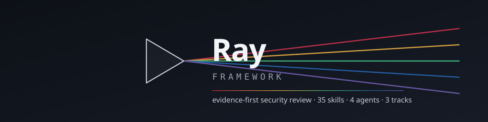
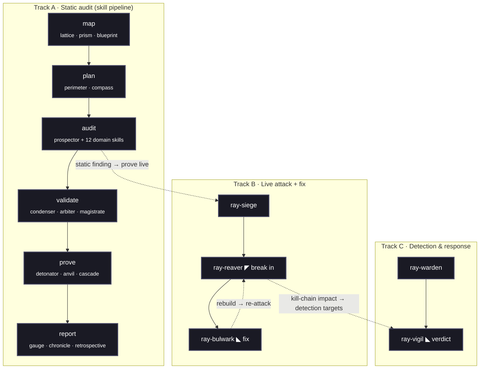

<h1>Ray Framework</h1>

<strong>An agentic, evidence-first security review pipeline built as a set of composable Claude Skills.</strong>

 

  

<em>Ray decomposes a full security engagement&mdash;from mapping a codebase to proving an exploit, patching it, and reporting it&mdash;into independent, single-responsibility stages, then adds a live attack+fix loop and a detection track.</em>

<h2>Why Ray Exists</h2>

Most LLM-driven vulnerability scanners rely on a single prompt asking <em>"is this code vulnerable?"</em>. That yields unpredictable false-positive and false-negative rates &mdash; it acts on the model's disposition.

<strong>Ray takes a distinct approach: no single model call is the final verdict.</strong>

<ul>
  <li><strong>Findings start guilty, not innocent.</strong> Validation assumes every reported anomaly is a false positive and must disprove it against the source (<code>ray-arbiter</code>, 13 rules).</li>
  <li><strong>A vulnerability is not confirmed until it is reproduced.</strong> Static suspicion triggers a sandboxed proof; authentic execution evidence (a sanitizer trace, an unauthorized 200, a crash) is required (<code>ray-detonator</code>).</li>
  <li><strong>Severity is capped, not merely scored.</strong> 27 auditable sanity caps mitigate inflation; every cap's verdict is recorded in the finding JSON (<code>ray-gauge</code>).</li>
  <li><strong>A fix is not trusted until it survives re-attack.</strong> No patch is <code>VERIFIED_SECURE</code> without &ge;3 boundary-mutated variants that all fail to trigger (<code>ray-anvil</code>/<code>ray-detonator</code>, gate INV-1).</li>
  <li><strong>The codebase is frozen mid-audit.</strong> Every pass runs against an immutable, content-hashed snapshot, so line numbers and regression history stay accurate as the repo evolves (<code>ray-conductor</code>).</li>
  <li><strong>Nothing is silently discarded.</strong> Drift and ambiguity route to <code>NEEDS_RESEARCH</code>; regressions are tracked, never filtered.</li>
</ul>

<h2>The Three Tracks</h2>

Run <strong>Track A</strong> always; add <strong>Track B</strong> when you have a runnable app and want proof-by-exploitation plus a fix; run <strong>Track C</strong> independently on a live estate. See <a href="docs/coverage-map.md">docs/coverage-map.md</a> for how the tracks connect.

<h2>The Skills Suite</h2>

<h3>Map &amp; Plan — run first, in order</h3>

<table>
  <tr><td><code>ray-lattice</code></td><td>Content-addressed structural/semantic index (optional accelerator).</td></tr>
  <tr><td><code>ray-prism</code></td><td>Bottom-up, security-focused digest of every directory.</td></tr>
  <tr><td><code>ray-blueprint</code></td><td>Interlinked knowledge base — architecture, entities, vuln classes.</td></tr>
  <tr><td><code>ray-perimeter</code></td><td>Threat model — trust boundaries, attacker profiles, deployment intent.</td></tr>
  <tr><td><code>ray-compass</code></td><td>Targeted review plan (<code>plan.json</code>) from the threat model + history.</td></tr>
  <tr><td><code>ray-ledger</code></td><td>Mines VCS history into <code>historical_insights.jsonl</code> for regression signal.</td></tr>
</table>

<h3>Audit — the generalist plus the domain suite (run the ones that fit)</h3>

<table>
  <tr><td><code>ray-prospector</code></td><td>Generalist sweep + business-logic/race/chain floor. Carries the <a href="ray-prospector/references/attack-classes.md">attack-class catalog</a> and <a href="ray-prospector/references/hunting-doctrine.md">hunting doctrine</a>.</td></tr>
  <tr><td><code>ray-crucible</code></td><td>Injection: SQL/NoSQL, XSS, command, SSTI, XXE, deserialization, SSRF, traversal, prototype pollution, smuggling.</td></tr>
  <tr><td><code>ray-turnstile</code></td><td>Identity &amp; access: authn, sessions/JWT/OAuth, MFA, IDOR/BOLA, BFLA, tenancy, OWASP API Top 10.</td></tr>
  <tr><td><code>ray-seam</code></td><td>Client/server boundary: validation, mass assignment, CORS, cache poisoning, host header, clickjacking, CSP, open redirect.</td></tr>
  <tr><td><code>ray-sentry</code></td><td>Abuse &amp; observability: rate limiting, exposed/debug endpoints, webhook signatures, shadow APIs, verbose errors.</td></tr>
  <tr><td><code>ray-vault</code></td><td>Datastore &amp; crypto: DB privileges, encryption at rest, primitive misuse, hardcoded secrets, PQC readiness.</td></tr>
  <tr><td><code>ray-citadel</code></td><td>Deployed architecture: network isolation, service-to-service trust, secrets at scale, blast radius.</td></tr>
  <tr><td><code>ray-custodian</code></td><td>Privacy &amp; web surface: TLS/headers, cookie flags, PII in logs/URLs, retention, data-subject rights.</td></tr>
  <tr><td><code>ray-marrow</code></td><td>Native/unsafe memory safety: OOB, UAF, double-free, integer overflow, type confusion, FFI.</td></tr>
  <tr><td><code>ray-oracle</code></td><td>The app's own LLM feature: prompt injection, MCP tool poisoning, insecure output handling, excessive agency (OWASP LLM Top 10 / ATLAS).</td></tr>
  <tr><td><code>ray-manifest</code></td><td>Dependencies: known-vulnerable versions (CVE), SBOM (CycloneDX), typosquats, malicious install scripts.</td></tr>
  <tr><td><code>ray-terrain</code></td><td>IaC / cloud / containers: Terraform/CFN/K8s/Docker misconfig, over-permissive IAM, public storage, image hardening.</td></tr>
  <tr><td><code>ray-steward</code></td><td>Maintenance over time: dependency/runtime EOL, patch cadence, backup+restore, DR readiness, rotation.</td></tr>
</table>

<h3>Validate → Prove → Score</h3>

<table>
  <tr><td><code>ray-condenser</code></td><td>Dedup/merge findings across the domain sweeps and prior passes.</td></tr>
  <tr><td><code>ray-arbiter</code></td><td>False-positive filter — guilty until disproven (13 rules; honors profile Review Overrides).</td></tr>
  <tr><td><code>ray-magistrate</code></td><td>Production-viability judge — filters debug-only / test-only / assertion-trap paths.</td></tr>
  <tr><td><code>ray-detonator</code></td><td>Sandbox PoC / crash reproducer; fail-closed evidence gate; variant-hunting re-attack.</td></tr>
  <tr><td><code>ray-anvil</code></td><td>Static-track patcher — minimal root-cause fix on a shadow, verified by re-attack (INV-1).</td></tr>
  <tr><td><code>ray-cascade</code></td><td>Composes confirmed findings into exploit chains (scored by entry point).</td></tr>
  <tr><td><code>ray-gauge</code></td><td>Evidence-based risk score with 27 auditable sanity caps (honors Calibration Overrides).</td></tr>
  <tr><td><code>ray-chronicle</code></td><td>Stakeholder-facing review packet.</td></tr>
  <tr><td><code>ray-retrospective</code></td><td>Extracts cross-run learnings from execution trajectories.</td></tr>
</table>

<h3>Standalone — use any time, outside the pipeline</h3>

<table>
  <tr><td><code>ray-conductor</code></td><td>Orchestrates a full pass: sync → pin → run → archive. The reference harness (<a href="bin/ray-conductor.py">bin/ray-conductor.py</a>).</td></tr>
  <tr><td><code>ray-siege</code></td><td>Live attack+fix loop against a disposable local app (dispatches the agents). Track B.</td></tr>
  <tr><td><code>ray-warden</code></td><td>Detection &amp; response on a running estate (dispatches <code>ray-vigil</code>). Track C.</td></tr>
  <tr><td><code>ray-loupe</code></td><td>General code review of a change (dispatches <code>ray-scrivener</code>; delegates deep security to the suite).</td></tr>
  <tr><td><code>ray-quarry</code></td><td>Authorized external attack-surface recon (OSINT/DNS/cert transparency).</td></tr>
  <tr><td><code>ray-cloak</code></td><td>Write-time secret guard + working-tree/git-history secret scan.</td></tr>
  <tr><td><code>ray-foundry</code></td><td>Interactive consultant for building a custom orchestrator harness.</td></tr>
</table>

<h3>Agents — subagents dispatched by a parent skill</h3>

<table>
  <tr><td>◤ <code>ray-reaver</code></td><td>Red · offensive. Breaks in for real, proves it with a canary. Dispatched by <code>ray-siege</code>.</td></tr>
  <tr><td>◣ <code>ray-bulwark</code></td><td>Blue · fix. Minimal idiomatic root-cause fix, one finding one commit. Dispatched by <code>ray-siege</code>.</td></tr>
  <tr><td>◣ <code>ray-vigil</code></td><td>Blue · detection. Read-only analyst; scored verdict + tier-appropriate recommendation. Dispatched by <code>ray-warden</code>.</td></tr>
  <tr><td>◈ <code>ray-scrivener</code></td><td>Review. High-precision review of a code change. Dispatched by <code>ray-loupe</code>.</td></tr>
</table>

<h2>Getting Started</h2>

<h3>Install</h3>

Skills ship as <code>ray-*/</code> directories at the repo root. Install them into your assistant's skill folder:

<pre><code>bin/ray-install.sh                    # ./.claude/skills (copy)
bin/ray-install.sh --link             # portable relative symlinks
bin/ray-install.sh --assistant gemini # ./.gemini/skills   (also: codex, cursor)
bin/ray-install.sh --dest /path/repo  # into another project</code></pre>

Claude Code discovers <code>.claude/skills/*/SKILL.md</code> and <code>.claude/agents/*.md</code> — both are wired up in this repo.

<h3>Run a full audit</h3>

<pre><code>python3 bin/ray-conductor.py begin --target . --state . --sync   # pin a snapshot
/ray-conductor --sync --profile=web-app                          # drive the pipeline
python3 bin/ray-conductor.py archive --state . --pass 1          # archive the pass</code></pre>

Or invoke stages by hand in the Track A order. See <a href="docs/usage-guide.md">docs/usage-guide.md</a> and the one-line router in <a href="AGENTS.md">AGENTS.md</a>.

<h3>Target profiles</h3>

Add <code>--profile=&lt;web-app|native|library|llm-app&gt;</code> so the pipeline tunes to the target. Ray is conservative by default (correct for a C parser, wrong for a web SaaS): <code>--profile=web-app</code> keeps <strong>CORS, rate-limit, cookie-flag, and dependency-CVE</strong> findings in scope instead of dismissing them as hygiene. Profiles inject <em>Review Overrides</em> (read by <code>ray-arbiter</code>) and <em>Calibration Overrides</em> (read by <code>ray-gauge</code>). See <a href="profiles/">profiles/</a> and <a href="docs/coverage-map.md">docs/coverage-map.md</a>.

<h2>The Finding Contract</h2>

Every stage reads and writes one JSON shape defined by <a href="schema.json"><code>schema.json</code></a>. Validate finding files any time:

<pre><code>python3 validate_findings.py workspace/findings/*.json
python3 validate_findings.py --self-test</code></pre>

The validator (jsonschema, with a zero-dependency fallback) enforces the pipeline's gates: <code>VALID ⇒ no UNKNOWN/FAIL</code>, <code>FAIL ⇒ FALSE_POSITIVE</code>, <code>VERIFIED_SECURE ⇒ failed_to_bypass + ≥3 clean variants</code>, <code>DUPLICATE ⇒ duplicate_of</code>.

<h2>Design Principles</h2>

<ol>
  <li><strong>Deterministic contracts.</strong> Every skill declares its reads, writes, and idempotency; every stage shares one finding schema.</li>
  <li><strong>Snapshot-pinned by default.</strong> One frozen, content-hashed state per pass for reproducibility and precise regression tracking.</li>
  <li><strong>Domain-agnostic core, profile-tuned edges.</strong> Conservative defaults; a target profile lifts the right caps for a web app, native code, a library, or an LLM app.</li>
  <li><strong>Fail conservative.</strong> Uncertain results route to <code>NEEDS_RESEARCH</code> / <code>not_attempted</code> / <code>UNKNOWN</code>; never a false clearance.</li>
  <li><strong>Token-efficient state.</strong> State lives on disk as UUID-keyed JSON; agents pass references, not payloads.</li>
</ol>

<h2>Multi-AI Integration</h2>

Ray is platform-agnostic. <code>bin/ray-install.sh</code> installs the skills into <code>.claude/skills/</code>, <code>.gemini/skills/</code>, <code>.codex/skills/</code>, or <code>.cursor/rules/</code>. The agents (<code>.claude/agents/</code>) are native to Claude Code; on other assistants the parent skills' dispatch sections carry the same behavior.

<h2>Status</h2>

<ul>
  <li><strong>35 skills (incl. the <code>ray-conductor</code> orchestrator) + 4 agents</strong> — the full Field-Manual architecture, installable and runnable.</li>
  <li><strong>Three tracks</strong> — static audit, live attack+fix, detection &amp; response.</li>
  <li><strong>One validated finding contract</strong> (<code>schema.json</code>) with an executable validator (self-test 10/10).</li>
</ul>

<h2>License</h2>

<a href="LICENSE">MIT License</a>

