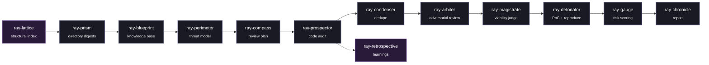

<h1>Ray Framework</h1>

<strong>An agentic, evidence-first security review pipeline built as a set of composable Claude Skills.</strong>

 

  

<em>Ray decomposes a full security audit&mdash;from mapping a codebase to shipping a stakeholder-facing report&mdash;into independent, single-responsibility stages.</em>

<h2>Why Ray Exists</h2>

Most LLM-driven vulnerability scanners rely on a single prompt asking <em>"is this code vulnerable?"</em>. This approach yields unpredictable false-positive and false-negative rates, essentially acting on the model's disposition.

<strong>Ray takes a distinct approach: No single model call serves as the final verdict.</strong>

<ul>
  <li><strong>Findings start as guilty, not innocent.</strong> The validation stage assumes every reported anomaly is a false positive. It must be explicitly disproven against the source code to survive.</li>
  <li><strong>A vulnerability is not confirmed until it is reproduced.</strong> Static suspicion triggers a sandboxed proof-of-concept. Authentic execution evidence (e.g., a sanitizer trace, an unauthorized HTTP 200 response, a crash signal) is strictly required.</li>
  <li><strong>Severity is capped, not merely scored.</strong> A rules-based sanity layer mitigates inflated severity by identifying dead code, test-only paths, implausible attacker positions, or missing defense-in-depth measures. A HIGH severity finding represents a validated risk.</li>
  <li><strong>The codebase is frozen mid-audit.</strong> Every execution pass runs against an immutable, content-hashed snapshot. A finding's line numbers, unresolved status, and regression history remain accurate as the repository evolves.</li>
  <li><strong>Nothing is silently discarded.</strong> Ambiguous cases are routed to <code>NEEDS_RESEARCH</code>, ensuring manual review. Regressions are explicitly flagged and tracked.</li>
</ul>

<h2>Pipeline Architecture</h2>

Each stage degrades gracefully if surrounding modules are unavailable, ensuring no single point of failure disrupts the campaign.

<h2>The Skills Suite</h2>

Ray's architecture relies on distinct, isolated skills. Each directory is self-contained with a dedicated <code>SKILL.md</code> documentation file.

<table>
  <thead>
    <tr>
      <th>Skill</th>
      <th>Stage</th>
      <th>Description</th>
    </tr>
  </thead>
  <tbody>
    <tr>
      <td><strong><code>ray-prism</code></strong></td>
      <td>Pre-processing</td>
      <td>Generates bottom-up, security-focused digests of every directory.</td>
    </tr>
    <tr>
      <td><strong><code>ray-blueprint</code></strong></td>
      <td>Knowledge base</td>
      <td>Synthesizes architecture, entities, and data flows into a linked knowledge base.</td>
    </tr>
    <tr>
      <td><strong><code>ray-perimeter</code></strong></td>
      <td>Knowledge base</td>
      <td>Builds the threat model, defining trust boundaries, attacker profiles, and assets.</td>
    </tr>
    <tr>
      <td><strong><code>ray-compass</code></strong></td>
      <td>Planning</td>
      <td>Translates the threat model and history into a targeted investigation roadmap.</td>
    </tr>
    <tr>
      <td><strong><code>ray-prospector</code></strong></td>
      <td>Discovery</td>
      <td>Performs wave-based swarm auditing of source files against the generated plan.</td>
    </tr>
    <tr>
      <td><strong><code>ray-condenser</code></strong></td>
      <td>Consolidation</td>
      <td>Merges duplicate findings across parallel sub-agents and execution passes.</td>
    </tr>
    <tr>
      <td><strong><code>ray-arbiter</code></strong></td>
      <td>Validation</td>
      <td>Assumes every finding is a false positive; actively attempts to disprove findings.</td>
    </tr>
    <tr>
      <td><strong><code>ray-magistrate</code></strong></td>
      <td>Validation</td>
      <td>Judges production viability, filtering out dead code, debug builds, and test-only paths.</td>
    </tr>
    <tr>
      <td><strong><code>ray-detonator</code></strong></td>
      <td>Verification</td>
      <td>Develops and executes sandboxed PoCs, demanding concrete execution evidence.</td>
    </tr>
    <tr>
      <td><strong><code>ray-gauge</code></strong></td>
      <td>Scoring</td>
      <td>Computes the final risk utilizing 27 sanity caps to prevent over-scoring and under-scoring.</td>
    </tr>
    <tr>
      <td><strong><code>ray-chronicle</code></strong></td>
      <td>Reporting</td>
      <td>Produces the finalized, stakeholder-facing Markdown review packet.</td>
    </tr>
    <tr>
      <td><strong><code>ray-retrospective</code></strong></td>
      <td>Meta</td>
      <td>Extracts durable lessons from agent trajectories for future passes.</td>
    </tr>
    <tr>
      <td><strong><code>ray-lattice</code></strong></td>
      <td>Meta (optional)</td>
      <td>Builds an AST-level structural index tailored for grep-scale codebases.</td>
    </tr>
    <tr>
      <td><strong><code>ray-foundry</code></strong></td>
      <td>Meta</td>
      <td>Acts as an interactive consultant for engineering custom orchestrators around Ray.</td>
    </tr>
  </tbody>
</table>

<h2>Design Principles</h2>

<ol>
  <li><strong>Deterministic contracts.</strong> Every skill explicitly declares its read operations, write operations, and idempotency guarantees.</li>
  <li><strong>Snapshot-pinned by default.</strong> Executions run against one frozen, content-hashed repository state, ensuring reproducibility and precise regression tracking.</li>
  <li><strong>Strictly advisory accelerators.</strong> Optional components (such as semantic retrieval or structural indexing) may reorder workloads but cannot authorize the skipping of files or call-sites.</li>
  <li><strong>Fail conservative.</strong> When a stage cannot confidently ascertain a result, it routes to <code>NEEDS_RESEARCH</code>, <code>not_attempted</code>, or <code>UNKNOWN</code>. It never issues a false positive clearance.</li>
  <li><strong>Token-efficient state management.</strong> State resides on disk via UUID-keyed JSON objects. Agents communicate via references rather than transmitting extensive text payloads.</li>
</ol>

<h2>Multi-AI Integration & Getting Started</h2>

Ray Framework is engineered to be platform-agnostic and works seamlessly across multiple AI agent environments. The repository includes native integration directories for the most prominent AI coding assistants.

<h3>Environment Setup</h3>

To deploy the skills into your target repository, copy or symlink the required <code>ray-*</code> skill directories into the corresponding configuration folder of your chosen AI assistant:

<ul>
  <li><strong>Claude:</strong> Place skills in the <code>.claude/skills/</code> directory within your workspace.</li>
  <li><strong>Gemini:</strong> Place skills in the <code>.gemini/skills/</code> directory.</li>
  <li><strong>Codex / OpenAI:</strong> Place skills in the <code>.codex/skills/</code> directory.</li>
  <li><strong>Cursor:</strong> Place skills in the <code>.cursor/rules/</code> directory to ensure they are ingested as repository rules.</li>
</ul>

Empty template directories for these platforms are already included at the root of this repository (<code>.claude</code>, <code>.gemini</code>, <code>.codex</code>, <code>.cursor</code>) to serve as structural references.

<h3>Executing a Pass</h3>

Once the skills are integrated into your AI environment's context, a minimal execution pass requires invoking them in the following sequence:

<pre><code>/ray-prism        # Generate repository map
/ray-blueprint    # Synthesize the knowledge base
/ray-perimeter    # Construct the threat model
/ray-compass      # Generate workspace/plan.json
/ray-prospector   # Execute audit and populate workspace/findings/*.json
/ray-condenser    # Deduplicate findings
/ray-arbiter      # Validate findings
/ray-magistrate   # Assess production viability
/ray-detonator    # Reproduce sandbox environments
/ray-gauge        # Calculate risk scores
/ray-chronicle    # Assemble final report</code></pre>

<blockquote>
  
<strong>Note:</strong> For continuous integration on a living codebase or when building a custom orchestrator, it is highly recommended to start with <code>ray-foundry</code>. It provides comprehensive guidance on the Pass Lifecycle Contract (sync, pin, run, archive) and optional extensions.

</blockquote>

<h2>Status</h2>

<ul>
  <li><strong>Core Pipeline:</strong> 14 skills are fully implemented and internally consistent.</li>
  <li><strong>Pending Components:</strong> Patch generation (<code>ray-anvil</code>), exploit chaining (<code>ray-cascade</code>), VCS history extraction (<code>ray-ledger</code>), and the reference orchestrator (<code>ray-conductor</code>). Contributions for these components are welcome.</li>
</ul>

<h2>License</h2>

<a href="LICENSE">MIT License</a>

