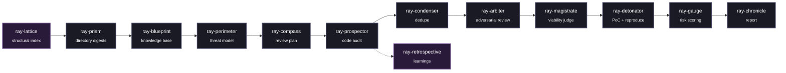

<div align="center">

<!-- You can replace banner.png with the exact filename of the uploaded photo -->


# 🛡️ Ray Framework

**An agentic, evidence-first security review pipeline built as a set of composable Claude Skills.**

[](https://opensource.org/licenses/MIT)
[]()
[]()

*Ray decomposes a full security audit—from mapping a codebase to shipping a stakeholder-facing report—into independent, single-responsibility stages.*

</div>

---

## ⚡ Why Ray Exists

Most LLM-driven "vulnerability scanners" rely on a single prompt asking *"is this code vulnerable?"*. This approach yields unpredictable false-positive and false-negative rates—essentially acting on the model's mood.

**Ray takes a different approach: Never let one model call be the whole verdict.**

- 🛑 **Findings start as guilty, not innocent.** The validation stage assumes every reported bug is a false positive. It must be *disproven* against the actual source code to survive.
- 💥 **A bug isn't "confirmed" until it's reproduced.** Static suspicion triggers a sandboxed proof-of-concept. Real execution evidence (a sanitizer trace, an unauthorized `200 OK`, a crash signal) is required—not just a confident paragraph.
- 📉 **Severity is capped, not just scored.** A rules-based sanity layer forces down anything that is dead code, test-only, requires an implausible attacker position, or is merely missing defense-in-depth. A `HIGH` finding actually means something.
- ❄️ **The codebase is frozen mid-audit.** Every pass runs against an immutable, content-hashed snapshot. A finding's line numbers, its "still open" status, and its regression history remain meaningful even as the real repo continues to evolve.
- 🔍 **Nothing gets silently dropped.** Ambiguous cases are routed to `NEEDS_RESEARCH`, never to the trash. Regressions are explicitly detected, never quietly re-merged into history.

---

## 🧩 Pipeline at a Glance

Every stage degrades gracefully if the surrounding stages are missing or unavailable. There is no single point of failure that can take down the entire campaign.



---

## 🛠️ The Skills Suite

Ray's architecture relies on distinct, isolated skills. Each folder is self-contained with a `SKILL.md` at its root.

| Skill | Stage | Description |
| :--- | :--- | :--- |
| 🔮 **`ray-prism`** | *Pre-processing* | Generates bottom-up, security-focused digests of every directory. |
| 🏗️ **`ray-blueprint`** | *Knowledge base* | Synthesizes architecture, entities, and data flows into a linked KB. |
| 🚧 **`ray-perimeter`** | *Knowledge base* | Builds the threat model: trust boundaries, attacker profiles, assets. |
| 🧭 **`ray-compass`** | *Planning* | Turns the threat model + history into a targeted investigation roadmap. |
| ⛏️ **`ray-prospector`** | *Discovery* | Wave-based swarm auditing of source files against the plan. |
| 🗜️ **`ray-condenser`** | *Consolidation* | Merges duplicate findings across parallel sub-agents and passes. |
| ⚖️ **`ray-arbiter`** | *Validation* | Assumes every finding is a false positive; must be disproven to survive. |
| 🧑‍⚖️ **`ray-magistrate`** | *Validation* | Judges production viability—kills dead code, debug builds, test-only paths. |
| 💣 **`ray-detonator`** | *Verification* | Writes and executes sandboxed PoCs; demands real execution evidence. |
| 🎛️ **`ray-gauge`** | *Scoring* | Computes final risk with 27 sanity caps against over/under-scoring. |
| 📜 **`ray-chronicle`** | *Reporting* | Produces the polished, stakeholder-facing Markdown review packet. |
| 🧠 **`ray-retrospective`** | *Meta* | Mines agent trajectories for durable lessons across future passes. |
| 🕸️ **`ray-lattice`** | *Meta (optional)*| AST-level structural index for grep-scale codebases. |
| 🏭 **`ray-foundry`** | *Meta* | Interactive consultant for building your own orchestrator around Ray. |

---

## 📐 Design Principles

1. **Deterministic contracts, not vibes.** Every skill declares exactly what it reads, writes, and its idempotency guarantee.
2. **Snapshot-pinned by default.** A pass reads one frozen, content-hashed copy of the codebase. Results are reproducible and regressions are detectable.
3. **HINT vs. AUTHORITATIVE, always explicit.** Optional accelerators can only *reorder* work—they never cause a real call-site or file to be skipped.
4. **Fail conservative.** When a stage can't confidently determine an outcome, it routes to `NEEDS_RESEARCH` / `not_attempted` / `UNKNOWN`—never to a false clean bill of health.
5. **Token-efficient by construction.** Large state lives on disk as UUID-keyed JSON; agents pass references, not walls of text.

---

## 🚀 Getting Started

Drop the required skill folders into your Skills directory (e.g., `.claude/skills/` for Claude Code or your Claude Platform skills workspace).

A minimal first pass looks like this:

```bash
/ray-prism        # Map the repo
/ray-blueprint    # Build the knowledge base
/ray-perimeter    # Build the threat model
/ray-compass      # Generate workspace/plan.json
/ray-prospector   # Audit and write workspace/findings/*.json
/ray-condenser    # Merge duplicates
/ray-arbiter      # Validate findings
/ray-magistrate   # Judge production viability
/ray-detonator    # Reproduce sandbox
/ray-gauge        # Score risks
/ray-chronicle    # Generate report
```

> **Pro Tip:** For a living/continuously-scanned codebase, or to wire in a custom orchestrator, start with `ray-foundry`. It will walk you through the full Pass Lifecycle Contract (sync, pin, run, archive) and the opt-in extensions.

---

## 📊 Status

- ✅ **Core Pipeline:** 14 skills implemented and internally consistent.
- ⏳ **Pending Supporting Skills:** Patch generation (`ray-anvil`), exploit chaining (`ray-cascade`), VCS history mining (`ray-ledger`), and the reference orchestrator itself (`ray-conductor`). Contributions and requests for these are welcome!

## 📜 License

[MIT License](LICENSE)
